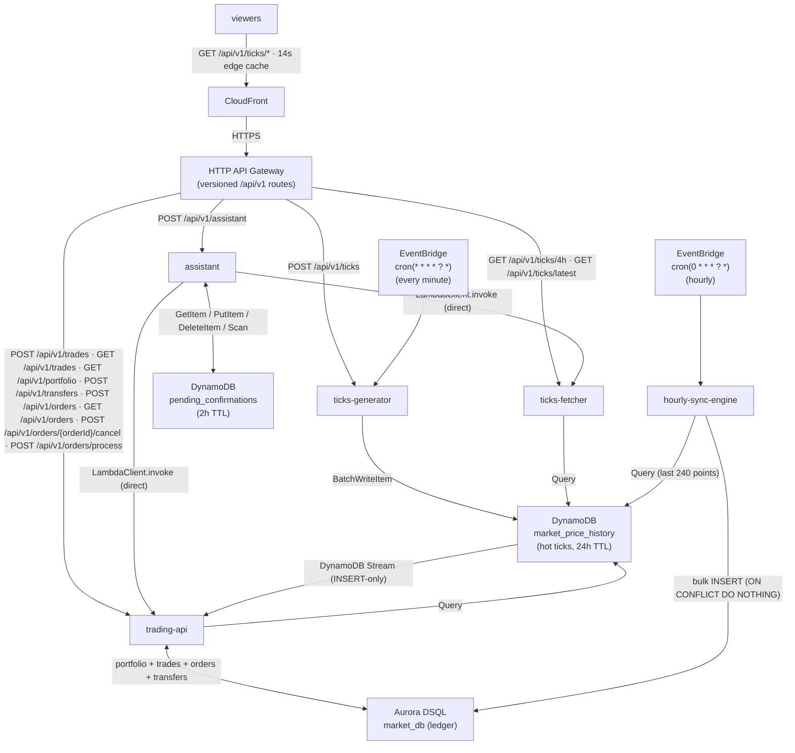

# infra — Serverless Polyglot Market Infrastructure

100% serverless and VPC-free (no VPCs, subnets, or NAT Gateways), designed to stay
inside the AWS Always Free Tier.

| Piece             | Technology                                                         | Free-tier impact                          |
| ----------------- | ------------------------------------------------------------------ | ----------------------------------------- |
| price store       | DynamoDB `market_price_history`, PROVISIONED 1/1 RCU/WCU, TTL 24h  | 25 GB + 25 RCU/WCU included               |
| pending store     | DynamoDB `pending_confirmations`, PROVISIONED 1/1 RCU/WCU, TTL 2h  | shares the same 25 GB + 25 RCU/WCU        |
| cache edge        | CloudFront distribution in front of an HTTP API Gateway            | 1 TB egress + 10M requests / mo included  |
| API layer         | API Gateway HTTP API, versioned `/api/v1/*` routes                 | 1M requests / mo included                 |
| tick compute      | `ticks-generator` Lambda (Node 22, 128 MB)                         | ~43k invocations / mo, ~50 ms each        |
| read compute      | `ticks-fetcher` Lambda (Node 22, 128 MB)                           | absorbed by the CloudFront edge (14s TTL) |
| trade compute     | `trading-api` Lambda (Node 22, 128 MB)                             | on-demand + reactive fill each tick       |
| fill trigger      | DynamoDB Stream (INSERT) → `trading-api`                           | 2.5M stream read requests / mo included   |
| sync compute      | `hourly-sync-engine` Lambda (Node 22, 128 MB)                      | 720 invocations / mo, 1 bulk INSERT each  |
| chat compute      | `assistant` Lambda (Node 22, 128 MB, Vite-bundled)                 | on-demand, ~50-200 ms per chat message    |
| relational ledger | Aurora DSQL (PostgreSQL dialect), single region                    | ~0 DPU (one 240-row INSERT / h)           |
| schedules         | EventBridge `cron(* * * * ? *)` (ticks) + `cron(0 * * * ? *)`      | negligible                                |

## Architecture

## Layout

    infra/
      lambdas/
        ticks-generator/       index.mjs + package.json (@aws-sdk/client-dynamodb)
        ticks-fetcher/         index.mjs + package.json (@aws-sdk/client-dynamodb)
        trading-api/           index.mjs + package.json (pg, @aws-sdk/client-dsql, @aws-sdk/client-dynamodb)
        hourly-sync-engine/    index.mjs + package.json (pg, @aws-sdk/client-dsql, @aws-sdk/client-dynamodb)
        assistant/             index.mjs + vite.config.js + package.json (chat-assistant workspace + @aws-sdk; Vite-bundled to dist/)
      terraform/
        versions.tf            terraform + provider version pins
        providers.tf           AWS provider region
        variables.tf           all tunables (market params, table/function names, TTLs, assistant LLM)
        main.tf                DynamoDB (price history + pending confirmations + stream trigger), API Gateway, CloudFront, 5 Lambdas, IAM, EventBridge, DSQL
        outputs.tf             endpoints + ARNs

## Deploy (manual)

1.  Install all workspace dependencies and build the assistant Lambda bundle.
    The assistant's Terraform `archive_file` zips `infra/lambdas/assistant/dist`,
    so the Vite build must run before `terraform plan` (the other four Lambdas
    are zipped with their own `node_modules`):

        npm install
        npm run build:assistant

2.  Configure AWS credentials and initialize Terraform:

    cd infra/terraform
    terraform init

3.  Validate and preview:

    terraform validate
    terraform fmt -check
    terraform plan

4.  Apply:

    terraform apply

## API Reference (via CloudFront)

| Method | Route                           | Lambda          | Notes                                                                            |
| ------ | ------------------------------- | --------------- | -------------------------------------------------------------------------------- |
| GET    | /api/v1/ticks/4h                | ticks-fetcher   | last 4h of 15s ticks (960 pts, oldest-first); `timestamp <= now` gate; 14s edge cache |
| GET    | /api/v1/ticks/latest            | ticks-fetcher   | most recent realized tick; `timestamp <= now` gate; 14s edge cache                     |
| POST   | /api/v1/ticks                   | ticks-generator | manual generation of the current minute's 4 slots                                |
| POST   | /api/v1/trades                  | trading-api     | `{ symbol, side: BUY\|SELL, quantity, idempotencyKey? }`                         |
| GET    | /api/v1/trades                  | trading-api     | recent trade history, `?limit=N`                                                 |
| GET    | /api/v1/portfolio               | trading-api     | cash, holdings, cost basis, realized gains, equity, open orders, recent activity |
| POST   | /api/v1/transfers               | trading-api     | `{ amount: +/-N, idempotencyKey? }`                                              |
| POST   | /api/v1/orders                  | trading-api     | `{ side, type: limit\|stop, quantity, price, idempotencyKey? }`                  |
| GET    | /api/v1/orders                  | trading-api     | list orders, `?status=open`                                                      |
| POST   | /api/v1/orders/{orderId}/cancel | trading-api     | cancel an open order (idempotent)                                                |
| POST   | /api/v1/orders/process          | trading-api     | internal/manual: fill triggered orders (DynamoDB stream-driven on each tick)     |
| POST   | /api/v1/assistant               | assistant       | `{ message }` chat request, or `{ action: confirm\|cancel, confirmationId }`; large trades gate on a DynamoDB pending confirmation |

## Notes

- Deterministic market math (Mulberry32, `(seed + blockIndex)` seeding) is
  repeated in `ticks-generator` so the Lambda is self-contained for
  `archive_file` zipping; the local server proxies the resulting ticks feed
  instead of simulating its own price series.
- DynamoDB TTL: every item carries `ttl = tick timestamp + 24h`, so data older
  than 24 hours is evicted at zero cost. The raw `timestamp` is NOT used as the
  TTL attribute — that would expire items the moment their tick goes live and
  DynamoDB would garbage-collect the history the fetcher and hourly sync
  depend on.
- The 4 pre-populated "future" slots of the current minute are hidden by the
  fetcher's `timestamp <= current server time` gate.
- The ticks-fetcher resolves its window from the route (`/api/v1/ticks/4h` →
  960 points, `/api/v1/ticks/latest` → 1 point) and ignores any user-supplied
  `limit`/`from` query strings. The CloudFront ticks cache policy therefore
  drops query strings from the cache key entirely.
- DSQL connections use the PostgreSQL wire protocol on port 5432 with an IAM
  db-connect token (`generateDbConnectAdminAuthToken`); SSL is mandatory. The
  Lambda IAM roles carry `dsql:Connect` on the cluster ARN (NOT an HTTP Data
  API ExecuteStatement).
- `price_history` is append-only; `hourly-sync-engine` re-runs are idempotent
  (`ON CONFLICT (symbol, ts) DO NOTHING`).
- `trading-api` holds the **entire account ledger** (portfolio + trades +
  orders + transfers) and is the single writer. Every mutation accepts an
  optional `idempotencyKey`; a duplicate key returns the stored result instead
  of re-executing.
- Open limit/stop orders are filled reactively: every tick `ticks-generator`
  writes into DynamoDB flows through the table stream into `trading-api`
  (INSERT-only event-source mapping), which evaluates open orders against the
  fresh price. `POST /api/v1/orders/process` remains as a manual fallback.
- The `assistant` Lambda bundles the shared `chat-assistant` workspace package
  (plus @aws-sdk) into a single `dist/index.mjs` via Vite, so it needs no
  `node_modules` at runtime. It invokes `trading-api` and `ticks-fetcher`
  directly with `@aws-sdk/client-lambda` (synchronous `RequestResponse`) rather
  than looping back out through CloudFront; its IAM role carries
  `lambda:InvokeFunction` on both functions. Pending confirmations live in the
  `pending_confirmations` DynamoDB table with a 2h TTL; reads treat expired
  items as missing because DynamoDB TTL garbage collection can lag ~48h.
- The local dev server (`server/`) is a stateless proxy over this API: set
  `TRADING_API_URL` to the `trading_api_base_url` Terraform output
  (`https://<cloudfront-domain>`) when running it.
